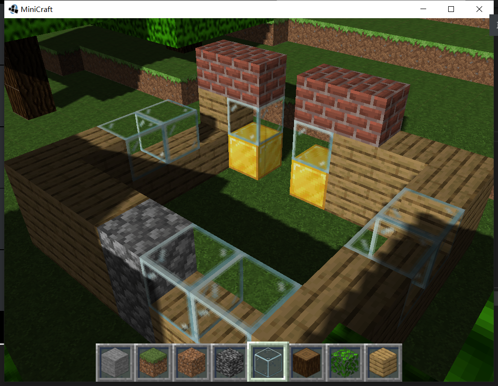

# MiniCraft

利用JME3库实现的简易Minecraft



由于版权原因，音乐文件没有上传到GitHub，遇到```IllegalStateException```很可能是音乐资源缺失导致，请在```assets/audio/music```目录下填充以下内容：

* 文件名：menu2.ogg  ，来源：Moog City 2
* 文件名：calm3.ogg ，来源：Sweden

## 操作说明
WSAD 前后左右

鼠标左键 破坏方块

鼠标右键 放置方块

Space  上/跳

左Shift 下/跳

Tab 切换是否低重力

上下键  切换物品栏

字母区1~8 选取方块

Esc 暂停(同时保存)
